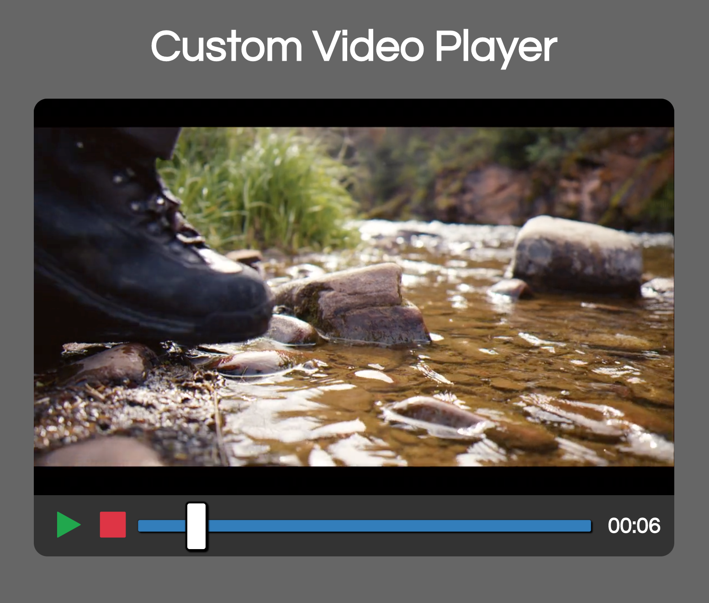
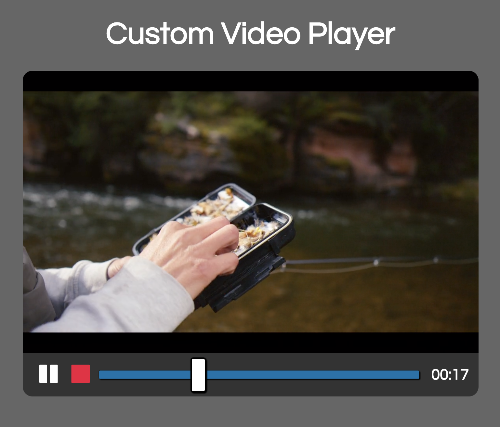

# Custom Video Player

This project follows along with the [20 Web Projects With Vanilla JavaScript](https://www.udemy.com/course/web-projects-with-vanilla-javascript/) tutorials by Brad Traversy.

This project creates a custom video player that allows the user to play, pause, and stop a video, as well as scroll to any place in the video. A timestamp is included as well. The video is set up to display and be user-friendly on various device screens, such as computer, tablet, and phone.

This project uses JavaScript, HTML, and CSS. To allow various browser compatibility, this project accessed code from [CSS Tricks](https://css-tricks.com/styling-cross-browser-compatible-range-inputs-css/).

